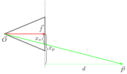

======
Theory
======
This documents the mathematical theory and computational optimziations behind the
rasterization process. Rasterization is the process of drawing pixels on the screen
given some 3D surface(s). In our case, we use Bézier surfaces to substitute the
conventional triangle.

In rasterization, we can loosely split the process up into
a few steps:

1. Camera Projection
2. Pixel Intersection
3. Depth Handling

Object Transformation
=====================
We define an :ref:`Object` as a collection of Bézier surfaces, each of which can have
order :math:`(n, m)`. For ease, we give each Object it's own local coordinate space (LCS),
and an associated origin which resides in the global coordinate space (GCS). Translations are
thus handled through a shift of the origin, and linear transformations are then handled
within the Object's LCS itself.

Basis
-----
We define a Basis for the Object, a :math:`3 \times 3` matrix whose columns are the
local :math:`\vec{x}_\ell, \vec{x}_\ell, \vec{z}_\ell` basis vectors for the Object.
To define the Basis, as opposed to Euler angles, we base if off the spherical
coordinates convention, where :math:`\vec{x}_\ell` is defined by :math:`(\theta, \varphi)`, where
:math:`\vec{x}_\ell = (1,0,0)^T` when :math:`\theta = \varphi = 0`. The other two basis vectors :math:`\vec{x}_\ell, \vec{y}_\ell` are defined a rotation :math:`\psi` about the x-axis, and
:math:`\vec{x}_\ell \times \vec{y}_\ell = \vec{z}_\ell`.

For the case :math:`\psi = 0`, :math:`\vec{y}_\ell` is parallel to the :math:`xy`-plane,
(no :math:`z` component). The Basis is then,

.. math::
   :nowrap:

   \begin{equation}
    \vec{x}_\ell = \begin{bmatrix} \cos\theta\cos\varphi \\ \sin\theta\cos\varphi \\ -\sin\varphi \end{bmatrix}, \quad
    \vec{y}_\ell(0) = \begin{bmatrix} -\sin\theta \\ \cos\theta \\ 0 \end{bmatrix}, \quad
    \vec{z}_\ell(0) = \begin{bmatrix} \cos\theta\sin\varphi \\ \sin\theta\sin\varphi \\ \cos\varphi \end{bmatrix}.
   \end{equation}

Now, to apply a :math:`\psi` rotation to :math:`\vec{y}_\ell, \vec{z}_\ell`, it is identical
as rotation of a 2D basis. That is,

.. math::
   :nowrap:

   \begin{equation}
    \begin{aligned}
    \vec{y}_\ell(\psi) &= \vec{y}_\ell(0)\cos(\psi) + \vec{z}_\ell(0)\sin(\psi),\\
    \vec{z}_\ell(\psi) &= -\vec{y}_\ell(0)\sin(\psi) + \vec{z}_\ell(0)\cos(\psi)
    \end{aligned}
   \end{equation}

Putting this together, we have that

.. math::
   :nowrap:

   \begin{equation}
    \vec{y}_\ell = \begin{bmatrix} \cos\theta\sin\varphi\sin\psi -\sin\theta\cos\psi \\ \sin\theta\sin\varphi\sin\psi + \cos\theta\cos\psi \\ \cos\varphi\sin\psi \end{bmatrix}, \quad
    \vec{z}_\ell = \begin{bmatrix} \cos\theta\sin\varphi\cos\psi + \sin\theta\sin\psi \\ \sin\theta\sin\varphi\cos\psi - \cos\theta\sin\psi \\ \cos\varphi\cos\psi \end{bmatrix},
   \end{equation}

where the Basis matrix is

.. math::
   :nowrap:

    \begin{equation}
    B_\ell(\theta\,\varphi,\psi) = \begin{bmatrix}
            \mid & \mid & \mid \\
            \vec{x}_\ell & \vec{y}_\ell & \vec{z}_\ell \\
            \mid & \mid & \mid
            \end{bmatrix}
    \end{equation}

Linear Transform
----------------
We define a transformation as a scaling (in any axis), and a new rotation. A scaling can
also be defined by a vector :math:`\vec{s} = (s_x, s_y, s_z)^T`. To scale
a Basis it is simply multiplying each column (basis vector) with the scaling. That is,

.. math::
   :nowrap:

   \begin{equation}
   B_\ell(\theta, \varphi, \psi, \vec{s}) = B_\ell(\theta, \varphi, \psi) \begin{bmatrix}s_x & 0 & 0 \\ 0 & s_y & 0 \\ 0 & 0 & s_z\end{bmatrix}
   = B_\ell(\theta, \varphi, \psi) \mathrm{diag}(s).
   \end{equation}

So, to transform between two Bases, the transformation matrix is

.. math::
   :nowrap:

    \begin{equation}
    \begin{aligned}
    T &= B_\ell(\theta_0, \varphi_0, \psi_0, \vec{s}_0)^{-1} B_\ell(\theta, \varphi, \psi, \vec{s})\\
    &= \mathrm{diag}(\vec{s}_0)^{-1} B_\ell(\theta_0, \varphi_0, \psi_0)^{-1} B_\ell(\theta, \varphi, \psi)
    \mathrm{diag}(\vec{s})\\
    &= \mathrm{diag}(\vec{s}_r) B_\ell(\theta_0, \varphi_0, \psi_0)^T B_\ell(\theta, \varphi, \psi),
    \end{aligned}
    \end{equation}

where :math:`\vec{s}_r = (s_x/s_{0x}, s_y/s_{0y}, s_z/s_{0z})`. The last step is justified from
the commutivity of diagonal matrices, and the fact for any unitary (i.e rotation) matrix :math:`U`,
we have :math:`U^{-1} = U^T`.

Camera Projection
=================
We can define a :ref:`Camera` with a position :math:`\vec{O}` three orthogonal vectors. The first is the focal vector :math:`\vec{f}`, which points in the direction of the camera, and magnitude the desired focal length. The other two vectors will be the basis vectors of the screen, :math:`\vec{x}_c, \vec{y}_c`,
where :math:`|\vec{x}_c| = |\vec{y}_c| = w_p`, the width of one pixel.

    The projection of :math:`\vec{P}` and the intersection with the camera, illustrating the
    similar triangles which arise.

In general, to project a relative point in the distance :math:`\vec{P}` onto the screen of the camera, we are not looking for the literal projection onto the camera plane. Rather, we wish to find the position that the vector intersects the camera plane. As shown in the figure above, in 1D, the projection gets us :math:`x_p`, whereas the desired value is :math:`x_s`. However, using the property of similar triangles, we can find that

.. math::
   :nowrap:

    \begin{equation}
    \begin{aligned}
    \frac{x_s}{x_p - x_s} = \frac{|\vec{f}|}{d} &\implies dx_s = f(x_p - x_s)\\
    &\implies x_s = \frac{|\vec{f}|}{d+|\vec{f}|} = \frac{|\vec{f}|^2}{\vec{P} \cdot \vec{f}}x_p
    \end{aligned}
    \end{equation}

This means that the real coordinate is just a constant correction factor applied to the standard projection.
To compute the standard projection, we compute the projections of :math:`\vec{P}` on the basis vectors, which we
can then correct with the above value. This gives us

.. math::
   :nowrap:

   \begin{equation}
   \vec{x_s} = \frac{|\vec{f}|^2}{(\vec{P} \cdot \vec{f})w_p^2}\begin{bmatrix} \vec{P} \cdot \vec{x}_c \\ \vec{P} \cdot \vec{y}_c \end{bmatrix},
    \end{equation}

which is a vector in the screen space, (like pixel number).

Surface Alignment
=================
For an order :math:`(n,m)` Bézier surface, it is defined by :math:`(n+1)(m+1)` control points, :math:`\mathcal{K} = \{\vec{k}\}_{i,j}^{n,m}`. The equation of the surface is given by

.. math::
   :nowrap:

    \begin{equation}
    \vec{S}_{n,m}(u,v) = \sum_{i=0}^N \sum_{j=0}^M B^n_i(u) B^m_j(v) \vec{k}_{i,j},
    \end{equation}

where the Berstein polynomial :math:`B^n_i(u)` is,

.. math::
   :nowrap:

    \begin{equation}
    B^n_i(u) = {n \choose i} u^i (1-u)^{n-i}.
    \end{equation}

and :math:`(u,v) \in [0,1]^2`.

To check if a particular pixel should display something, we need to check if its corresponding ray
pixel ray :math:`\vec{p}`, (focal point to location on screen) will intersect an Surface.
This means for a given Surface, we need to check if there exists a :math:`(u,v)` such that
:math:`S(u,v) - \vec{f}` will be parallel to :math:`\vec{p}`. We can define an alignment function

.. math::
   :nowrap:

    \begin{equation}
    A_{\mathcal{K}, \vec{p}}(u, v) = |\vec{p} \times (\vec{S}(u,v) - \vec{f})|^2 = |\vec{c}(u,v)|^2,
    \end{equation}

which attains its global minimum 0 when the vectors are aligned. So, if there exists :math:`(u,v)` in the
bounds such that :math:`A_{\mathcal{K}, \vec{p}}(u,v) = 0`, that particular pixel ray must intersect the Surface.

Derivatives
-----------
To do this, we need to calculate its gradient,

.. math::
   :nowrap:

    \begin{equation}
    \nabla A(u,v) = \nabla [c(u,v)^2] = 2 J^T[\vec{c}(u,v)] \vec{c},
    \end{equation}

which decomposes into the derivatives of the Bernstein polynomials, since

.. math::
   :nowrap:

    \begin{equation}
    \begin{aligned}
    J[\vec{c}(u,v)] &= J\left[ \vec{p} \times \vec{S}(u,v) - \vec{p} \times \vec{f} \right]\\
    &= J\left[\vec{p} \times \vec{S}(u,v) \right]\\
    &= \sum_{i,j=0}^{n,m} (\vec{p} \times \vec{k}_{i,j}) \nabla^T \left( B^n_i(u) B^m_j(v) \right)\\
    &= \sum_{i,j=0}^{n,m} \sum_{j=0}^m (\vec{p} \times \vec{k}_{i,j}) \begin{bmatrix}
        B_j^m(v) \partial_u B^n_i(u) & B_i^n(u) \partial_v B_j^m(v)
    \end{bmatrix}.
    \end{aligned}
    \end{equation}

Generically, we have that the derivative of a Bernstein polynomial

.. math::
   :nowrap:

    \begin{equation}
    \begin{aligned}
    \partial_u B^n_i(u) &= {n \choose i} \left(iu^{i-1}(1-u)^{n-i} - (n-i)u^i(1-u)^{n-i-1}\right) \\
    &= {n \choose i}(1-u)^{n-i-1}((i-n)u^i + iu^{i-1}(1-u))\\
    &= {n \choose i}u^{i-1}(1-u)^{n-i-1}((i-n)u + i(1-u))\\
    &= {n \choose i}u^{i-1}(1-u)^{n-i-1}(i-un)
    \end{aligned}
    \end{equation}

Additionally, we can calculate its Hessian, (second derivative) by expanding out the
terms manually. Afterwards, we can obtain an expression,

.. math::
   :nowrap:

   \begin{equation}
    H[A(u,v)] = J^T(\vec{c})J(\vec{c}) + \begin{bmatrix}
        \vec{c} \cdot \partial_u^2 \vec{c} & \vec{c} \cdot \partial_{uv} \vec{c}\\
        \vec{c} \cdot \partial_{vu} \vec{c} & \vec{c} \cdot \partial_v^2 \vec{c}
    \end{bmatrix}
   \end{equation}

Following similarly as above, for any differential operator :math:`D`

.. math::
   :nowrap:

    \begin{equation}
    D [\vec{c}(u,v)] = D \left[\vec{p} \times \vec{S}(u,v) \right] = \sum_{i.j=0}^{n,m} (\vec{p} \times \vec{k}_{i,j}) D \left( B^n_i(u) B^m_j(v) \right).
    \end{equation}

Using that generically,

.. math::
   :nowrap:

    \begin{equation}
    \partial_u^2 B_i^n(u) =
    \end{equation}
